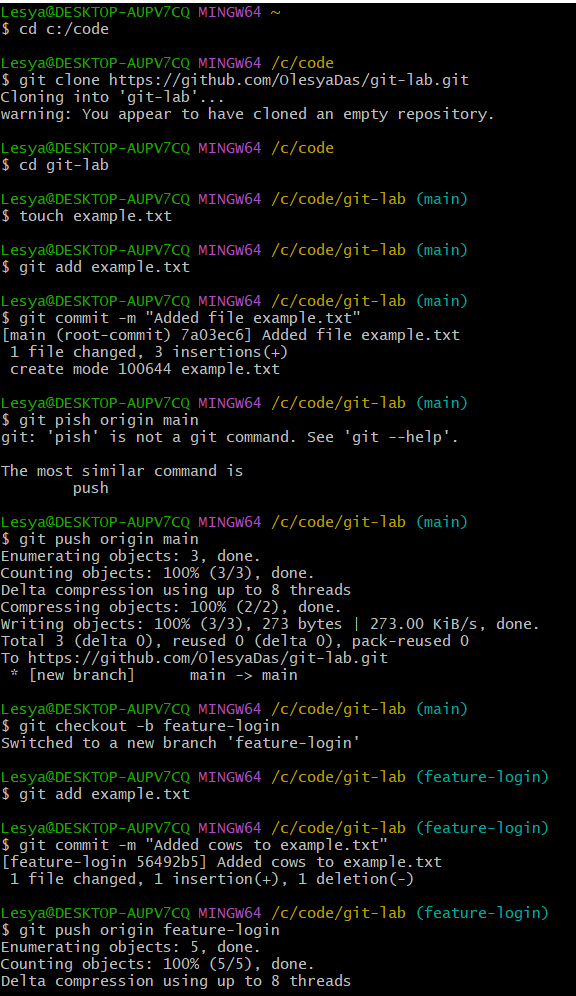
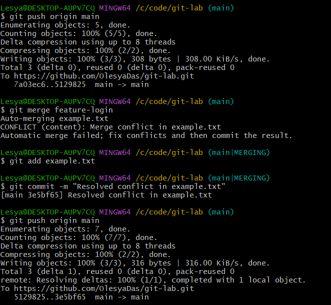
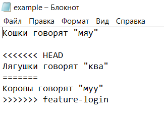
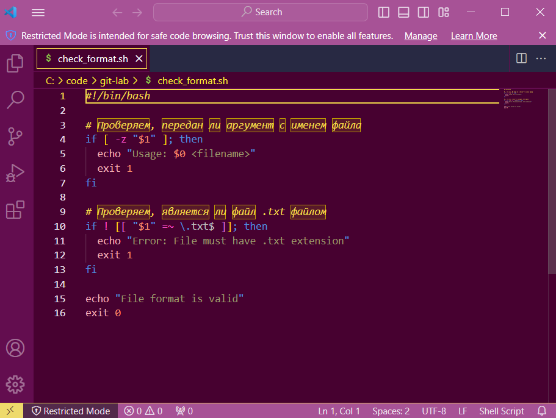
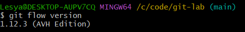
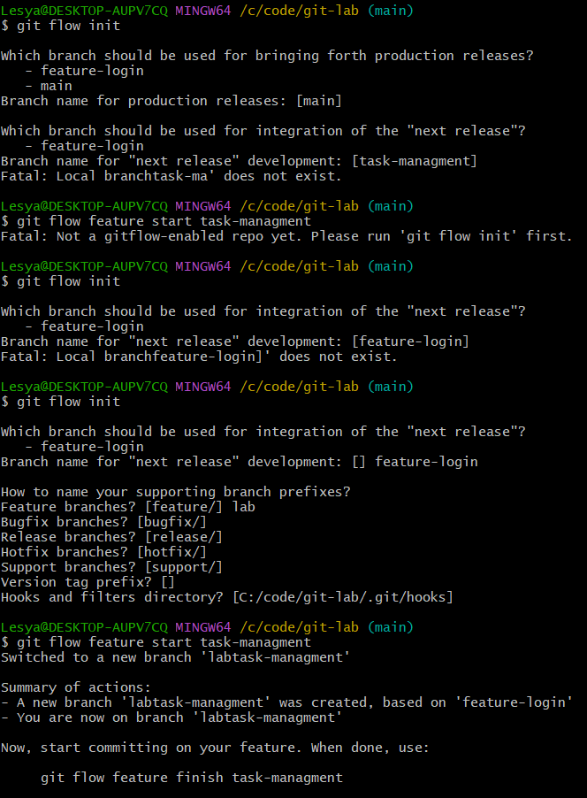
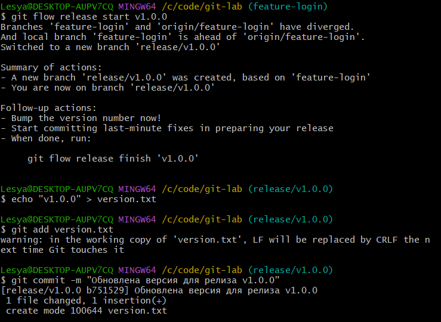
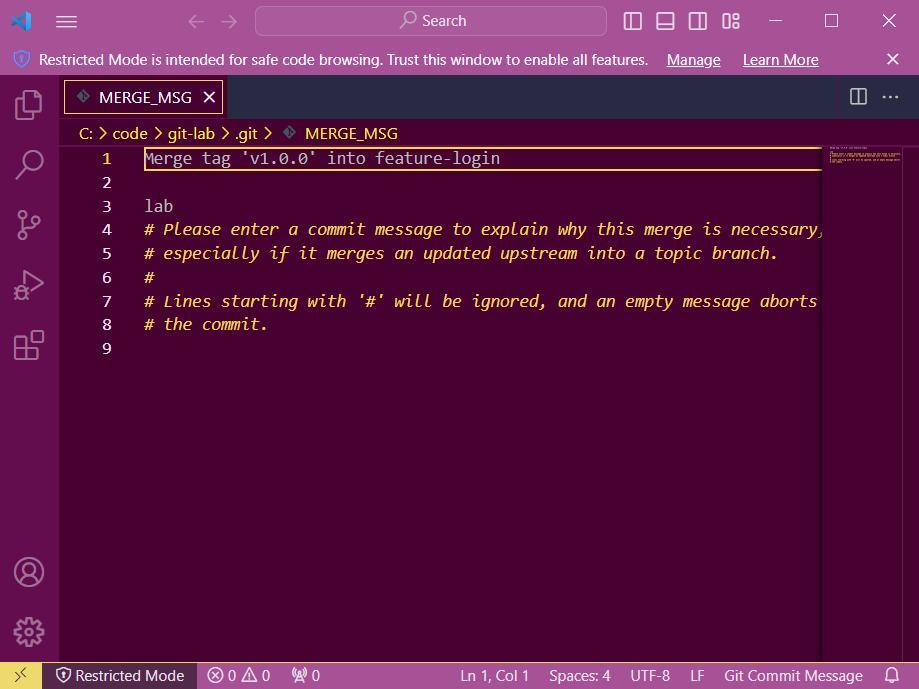
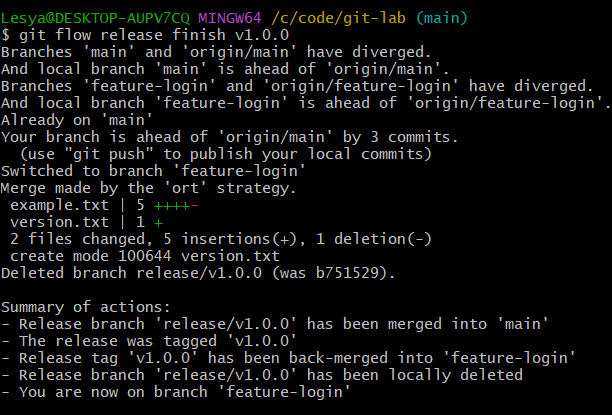
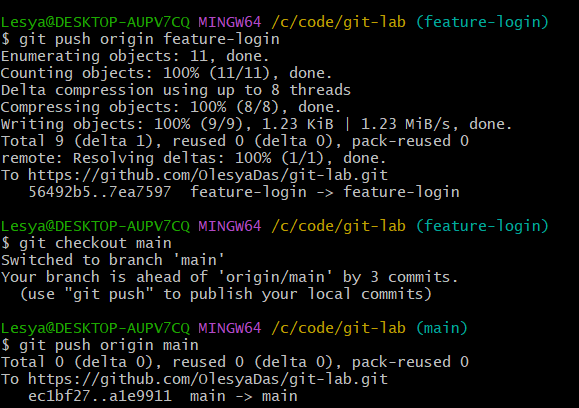

# Отчет о выполненной лабораторной работе

## Разрешение конфликта

Для начала был клонирован репозиторий git-lab, в котором был создан файл example.txt:

> Кошки говорят "мяу"
>
> Собаки говорят "гав"

Файл был закоммичен. Затем с помощью команды 'git checkout -b feature-login' была создана ветка feature-login, в которой наполнение файла example.txt было изменено:

> Кошки говорят "мяу"
>
> Коровы говорят "муу"

Файл снова был закоммичен. После, перейдя обратно в main файл вновь был изменен:

> Кошки говорят "мяу"
>
> Лягушки говорят "ква"

Был сделан коммит этого изменения. Для создания конфликта, была использована команда 'git merge feature-login'. Для разрешения конфликта были удалены метки и оставлены нужные изменения, которые были закоммичены. Конфликт решен.

## Автоматизация проверки формата файлов при коммите

Следующая задача - создать bash-скрипт check_format.sh, чтобы перед каждым коммитом Git проверял формат файла. Код скрипта можно увидеть на рисунке ниже.

С помощью команд 'cp check_format.sh .git/hooks/pre-commit' и 'chmod +x .git/hooks/pre-commit' файл с bash-скриптом был добавлен в репозиторий .git/hooks и проверили, что он исполняемый. Конфликтов в данном разделе не возникло.

## Использование Git Flow в проекте

После проверки наличия Git Flow на локальной машине, была выполнена инициализация Git Flow и создана ветка task-managment для новой функциональности. В ней был создан файл task-manager.py, позде закоммиченый. После завершения разработки функции завершаем фичу  и объединяем с основной веткой. Затем был совершен релиз, по завершению которого изменения были отправлены на удаленый репозиторий и работа завершена.

